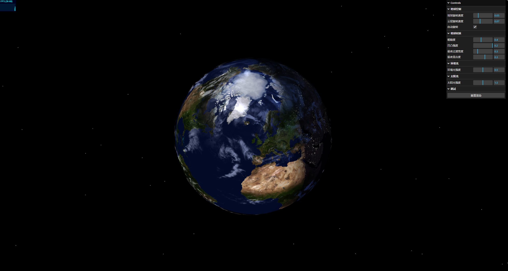

# 计算机图形学作业集合

### 使用方法
1. 进入项目目录：`cd assignment (n)`n为作业序号
2. 安装依赖：`npm install`
3. 启动开发服务器：`npm run dev`
4. 在浏览器中打开显示的地址查看项目

## 项目概述

本仓库包含计算机图形学课程的多个作业项目，每个项目展示不同的图形学技术和效果。

## assignment1：地球与星空 (Earth and Space)

### 项目描述
这是一个基于Three.js的交互式3D地球可视化项目。该项目实现了一个地球模型，包括大气层、日夜纹理变化、云层。用户可以通过鼠标操作来旋转和缩放地球视图。




## assignment2：粒子效果系统 (Particle Effects)

### 项目描述
这是一个基于WebGL的粒子系统模拟项目。该项目展示了如何使用WebGL和着色器技术创建各种视觉上引人注目的粒子效果，如烟花、火焰、雨滴和雪花等。

## 作业三：[待定]

### 项目描述
[待补充]

### 文件结构
```
assignment3/
└── [待完成]
```

## 技术栈
- Three.js
- WebGL
- JavaScript
- HTML5/CSS3
- Vite (构建工具)

## 运行环境要求
- Node.js 14.0+
- 现代浏览器，支持WebGL (推荐Chrome, Firefox, Edge最新版本)
- 显卡支持WebGL 2.0

## 开发与贡献
欢迎提出建议和改进意见，可以通过创建Issue或Pull Request来参与项目开发。 