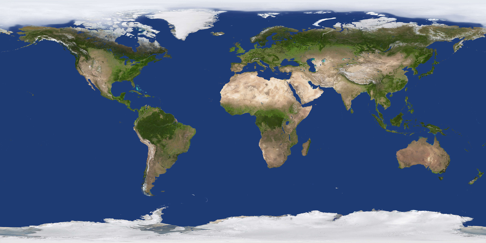

# 计算机图形学作业集合

## 项目概述

本仓库包含计算机图形学课程的多个作业项目，每个项目展示不同的图形学技术和效果。

## 作业一：地球与星空 (Earth and Space)

### 项目描述
这是一个基于Three.js的交互式3D地球可视化项目。该项目实现了一个逼真的地球模型，包括大气层、日夜纹理变化、云层以及月球。用户可以通过鼠标操作来旋转和缩放地球视图。

### 技术特点 

## 作业二：粒子效果系统 (Particle Effects)

### 项目描述
这是一个基于WebGL的粒子系统模拟项目。该项目展示了如何使用WebGL和着色器技术创建各种视觉上引人注目的粒子效果，如烟花、火焰、雨滴和雪花等。

### 技术特点 