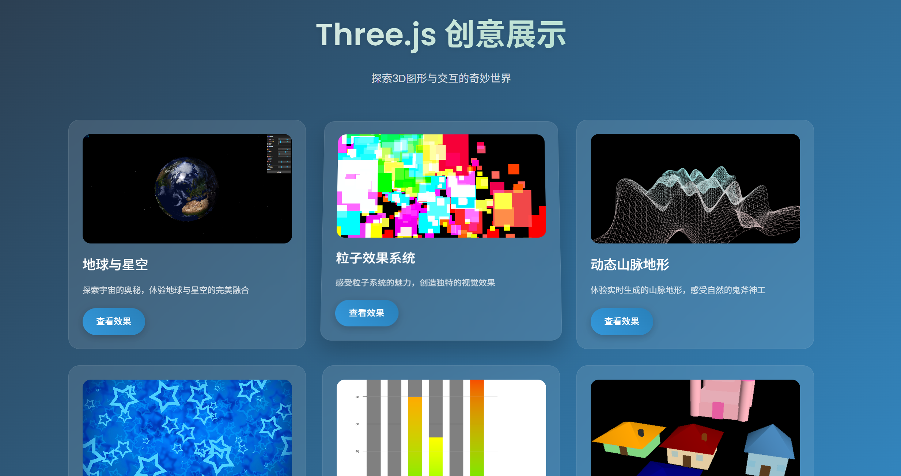
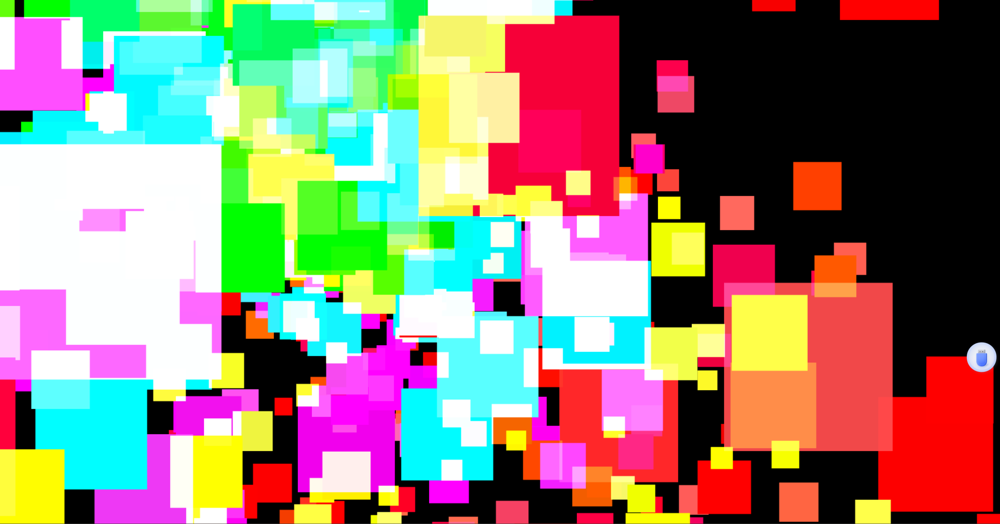
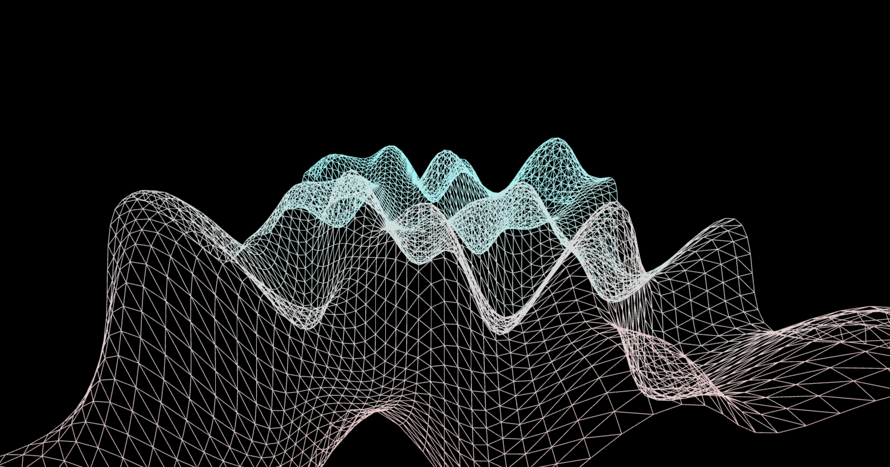
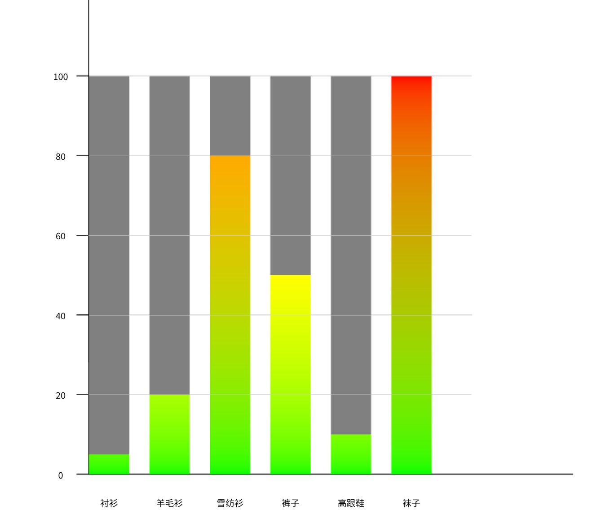
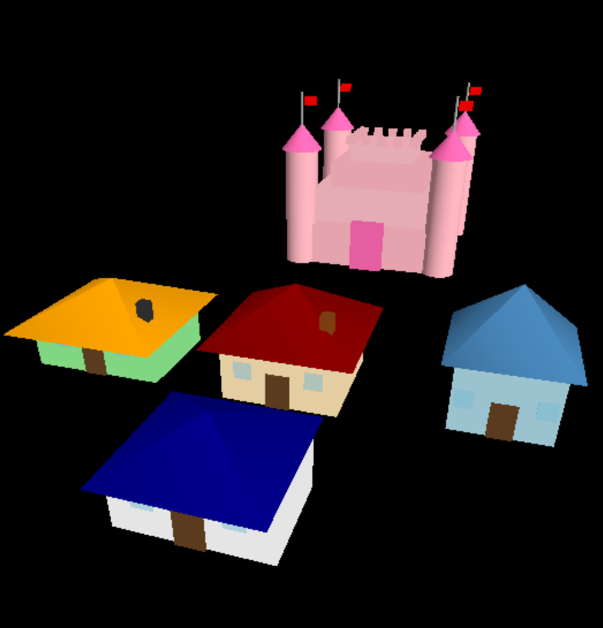
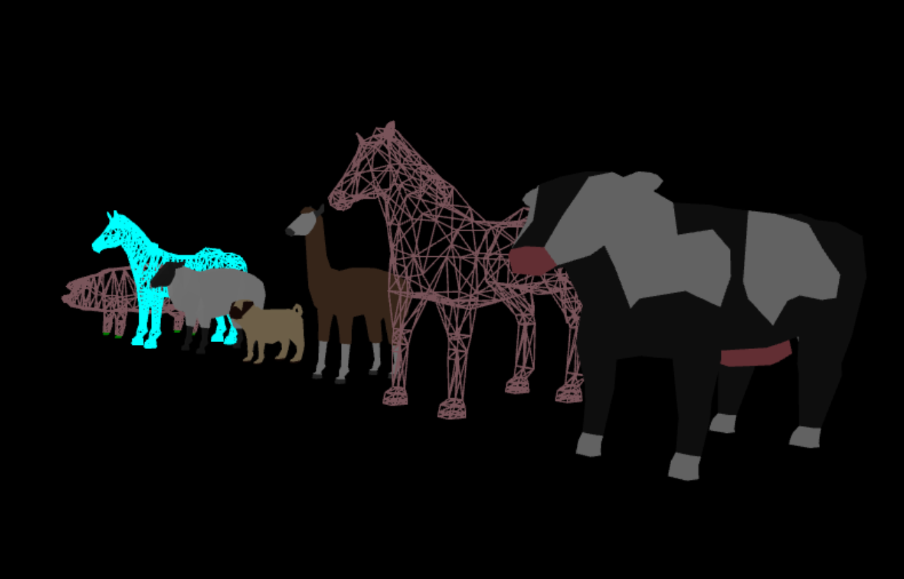

# 计算机图形学作业集合

### 使用方法
1. 进入项目目录：`cd assignment (n)`n为作业序号
2. 安装依赖：`npm install`
3. 启动开发服务器：`npm run dev`
4. 在浏览器中打开显示的地址查看项目

或者直接打开/dist 启动服务http-server 就可以直接打开和查看集成好的项目

## 项目概述

本仓库包含计算机图形学课程的多个作业项目，每个项目展示不同的图形学技术和效果。

## assignment1：地球与星空 (Earth and Space)
### 项目描述
这是一个基于Three.js的交互式3D地球可视化项目。该项目实现了一个地球模型，包括大气层、日夜纹理变化、云层。用户可以通过鼠标操作来旋转和缩放地球视图。


## assignment2：粒子效果系统 (Particle Effects)
### 项目描述
这是一个基于WebGL的粒子系统模拟项目。-交互式烟花效果：点击屏幕任意位置即可触发烟花


## assignment3：动态山脉地形 (Dynamic Mountain Terrain)
### 项目描述
这是一个基于 Three.js 的动态地形生成系统，使用 Simplex 噪声算法创建自然流畅的山脉地形，并通过实时动画模拟地形的起伏变化。项目展示了程序化地形生成和实时3D渲染的结合应用。


## assignment4：无限隧道穿越 (Infinite Tunnel)
### 项目描述
这是一个基于 Three.js 的无限隧道穿越效果项目。通过使用着色器(Shader)技术，实现了流畅的隧道视觉效果，包括动态光效、扭曲变形和速度感。项目展示了现代WebGL着色器编程和实时3D渲染的高级应用。


## assignment5：柱状图 (Bar Chart)
### 项目描述
这是一个基于 Three.js 的3D柱状图可视化项目。通过使用 Three.js 的几何体和材质系统，实现了动态的3D柱状图展示效果，包括数据更新动画、交互式缩放和旋转功能。项目展示了如何使用 Three.js 进行数据可视化的实践应用。


## assignment6：3D房屋建模 (3D House Modeling)
### 项目描述
这是一个基于 Three.js 的3D房屋建模项目。通过使用 Three.js 的几何体和材质系统，实现了多种风格的房屋模型，包括主体结构、屋顶、门窗和烟囱等细节。项目展示了如何使用 Three.js 进行3D建模和场景构建的实践应用。


## assignment7：3D动物模型展示 (3D Animal Models)
### 项目描述
这是一个基于 Three.js 的3D动物模型展示项目。通过使用 Three.js 的模型加载器和材质系统，实现了多个精美的3D动物模型展示，包括马、猪、斑马、羊、哈巴狗、羊驼和奶牛等。项目展示了如何使用 Three.js 进行3D模型加载、材质设置和场景构建的实践应用。用户可以通过鼠标进行模型的旋转、缩放和平移操作。


### 文件结构
```
assignment3/
└── [待完成]
```

## 技术栈
- Three.js
- WebGL
- JavaScript
- HTML5/CSS3
- Vite (构建工具)

## 运行环境要求
- Node.js 14.0+
- 现代浏览器，支持WebGL (推荐Chrome, Firefox, Edge最新版本)
- 显卡支持WebGL 2.0

## 开发与贡献
欢迎提出建议和改进意见，可以通过创建Issue或Pull Request来参与项目开发。 